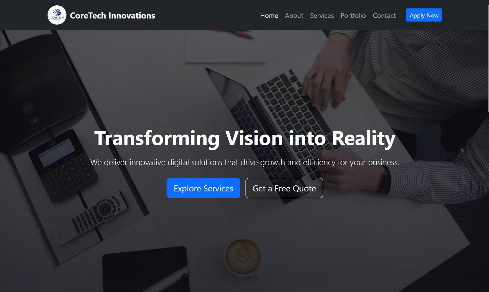
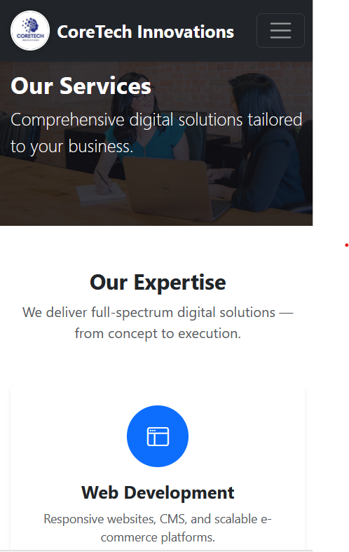

## 🌐 CoreTech Innovations — Company Website
A responsive multi-page company website built with **Bootstrap 5**, **custom CSS**, and **JavaScript**.  
Includes smooth scroll animations, service showcase, portfolio section, and a working contact form (demo).

## 🚀 Live Demo
🔗 [View on GitHub Pages](https://hanii247.github.io/Project1-Frontend-/)

## 📂 Project Structure
coretech-innovations/

│── index.html       # Home page

│── about.html       # About Us page

│── services.html    # Services page

│── portfolio.html   # Portfolio showcase

│── contact.html     # Contact page

│── styles.css       # Custom styles

│── main.js          # JavaScript (form validation + AOS)

│── assets/          # Logo + social icons + images

│    ├── logo.png

│    ├── facebook.png

│    ├── instagram.png

│    ├── twitter.png

│    ├── mobileView.png

│    └── desktopView.png


## ⚙️ Setup Instructions

1. Clone this repository:
   ```bash
   git clone https://github.com/Hanii247/Project1-Frontend-.git
   cd coretech-innovations

2. Open index.html in your browser.

3. (Optional) Deploy to GitHub Pages:

- Go to Settings → Pages

- Set source to main branch → /root

- Save & visit your live site URL.

## 📸 Screenshots

- 🖥️ Desktop View

- 📱 Mobile View


## ✨ Features

- 🖥️ Multi-page design (Home, About, Services, Portfolio, Contact)
- 📱 Mobile-friendly responsive layout (Bootstrap Grid + Media Queries)
- 🎨 Custom hover effects & animations
- 🚀 AOS (Animate on Scroll) integration for smooth reveals
- 📧 Contact form with validation
- 🌗 Clean UI/UX with modern branding

## 👩‍💻 Tech Stack

- HTML5
- CSS3 (custom styles + hover effects)
- Bootstrap 5
- JavaScript (vanilla)
- AOS.js for scroll animations

## 📌 License

This project is licensed under the MIT License.

© 2025 CoreTech Innovations


